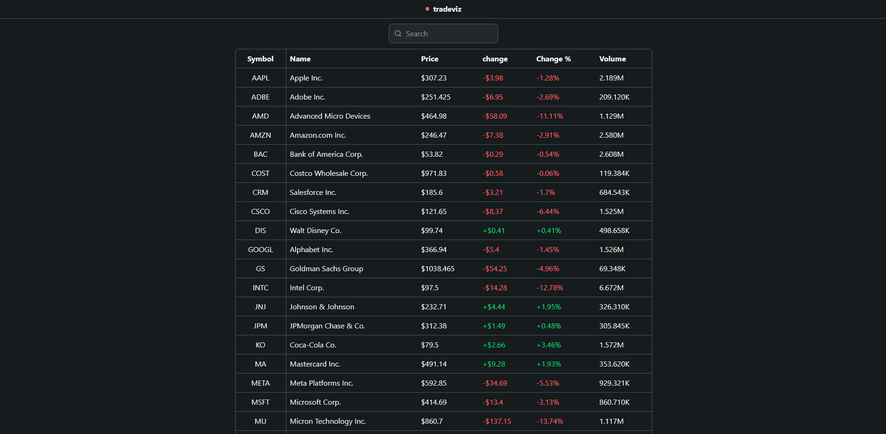
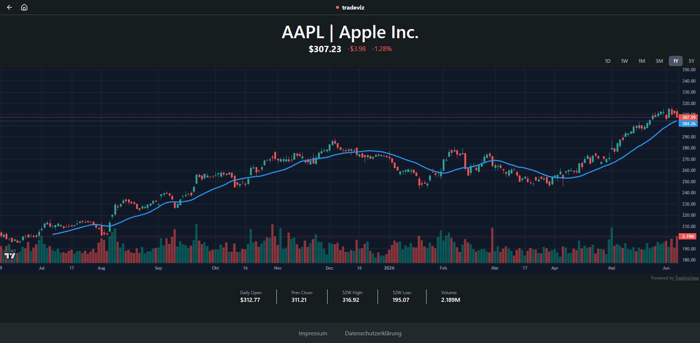

# tradeviz

Real-time stock market dashboard. Track live prices, analyze candlestick charts with technical indicators, and monitor market movements across 30 major US stocks.


**[Live Demo](https://tradeviz.vercel.app)**

---

## Screenshots

| Dashboard                                 | Stock Detail                        |
| ----------------------------------------- | ----------------------------------- |
|  |  |

---

## Features

- **Live Prices** — Real-time stock price updates via WebSocket (Alpaca Markets / IEX Exchange)
- **Candlestick Charts** - Interactive charts powered by TradingView Lightweight Charts
- **Technical Indicators** - 20-period Moving Average computed server-side with pandas
- **Volume Bars** - Per-period volume displayed below the main chart
- **Timeframe Toggle** - Switch between 1D, 1W, 1M, 3M, 1Y, 5Y views
- **Live Candle Updates** - Current candle updates in real time on the 1D chart
- **52-Week High/Low** - Calculated from historical bar data
- **Search** - Filter stocks by ticker or company name
- **30 Major US Stocks** - Covers the most actively traded US equities
- **DSGVO Compliant** - Impressum and Datenschutzerklärung included

---

## Tech Stack

| Layer           | Technology                          |
| --------------- | ----------------------------------- |
| Frontend        | React 19 + Vite                     |
| Language        | TypeScript                          |
| Styling         | Tailwind CSS v4                     |
| Charts          | TradingView Lightweight Charts      |
| Backend         | FastAPI (Python)                    |
| Data            | Alpaca Markets API (IEX Exchange)   |
| Data Processing | pandas                              |
| Real-time       | WebSocket (FastAPI + Alpaca stream) |
| Frontend Deploy | Vercel                              |
| Backend Deploy  | Railway (Docker)                    |

---

## Getting Started

### Prerequisites

- Node.js 18+
- Python 3.10+
- Alpaca Markets account (free tier)

### Installation

```bash
git clone https://github.com/Konstantin-Bs/tradeviz.git
cd tradeviz
```

### Backend Setup

```bash
cd backend
python -m venv venv
source venv/Scripts/activate  # Windows
source venv/bin/activate       # Mac/Linux
pip install -r requirements.txt
```

#### Environment Variables

Create `backend/.env`:

```
ALPACA_API_KEY=your_alpaca_api_key
ALPACA_SECRET_KEY=your_alpaca_secret_key
```

### Frontend Setup

```bash
cd frontend
npm install
```

#### Environment Variables

Create `frontend/.env`:

```
VITE_API_URL=http://localhost:8000
VITE_WS_URL=ws://localhost:8000/ws
```

### Run Locally

Backend:

```bash
cd backend
source venv/Scripts/activate
uvicorn main:app --reload
```

Frontend:

```bash
cd frontend
npm run dev
```

Open [http://localhost:5173](http://localhost:5173)

---

## Project Structure

```
tradeviz/
  backend/
    routers/        → API endpoints (stocks, websocket)
    services/       → Alpaca data fetching, WebSocket logic
    models/         → Constants (tickers, company names)
    main.py         → FastAPI app, CORS, lifespan
  frontend/
    src/
    components/     → Navbar, Footer, ErrorBoundary
    pages/          → Dashboard, StockDetail, legal pages
    hooks/          → useWebSocket
    services/       → API call functions
    types/          → TypeScript interfaces
  docker-compose.yml
```

---

## Data & Legal

Market data is provided by [Alpaca Markets](https://alpaca.markets) via IEX Exchange and is for informational purposes only. Prices may not reflect all market activity. This application does not constitute financial advice.

Charts powered by [TradingView Lightweight Charts™](https://www.tradingview.com)

---

## Roadmap

- [ ] Zustand for optimized WebSocket state management
- [ ] Sentry error monitoring
- [ ] RSI indicator
- [ ] Chart legend with dynamic OHLC values on hover

---

## License

MIT
